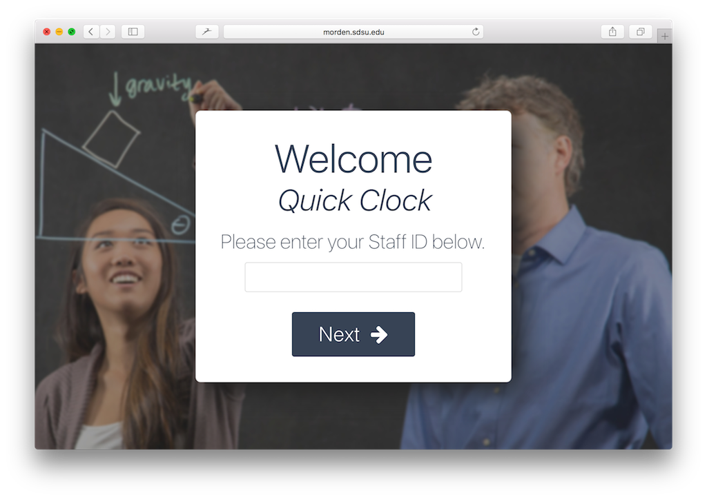
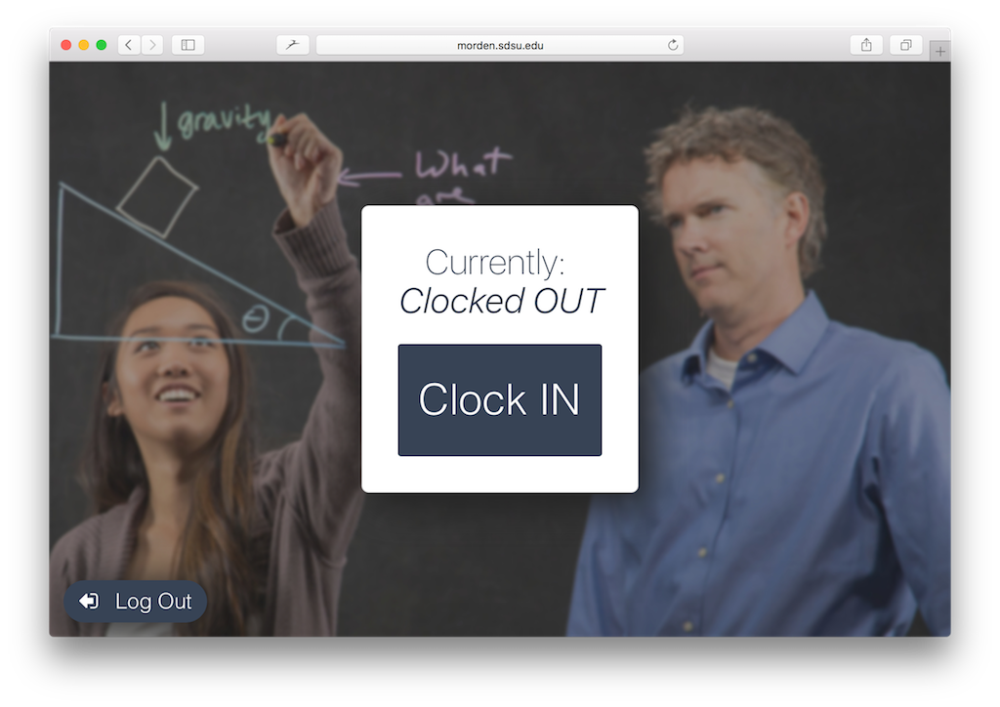
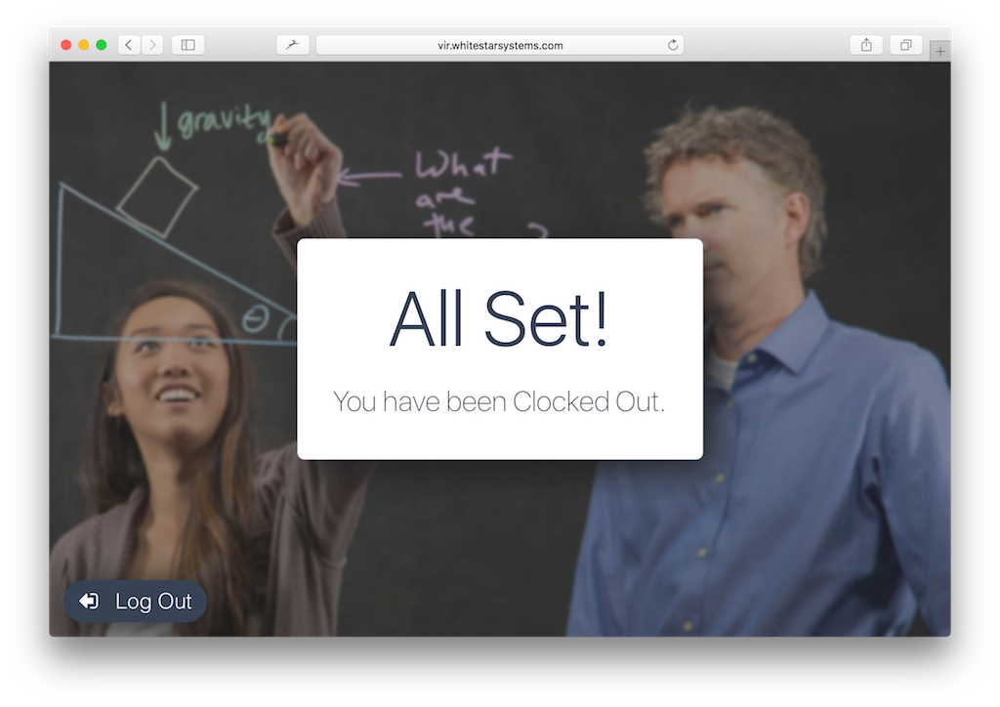

# For Staff

Staff can access the Clock In/Out system via the Quick Clock, using the URL provided by the Welcome System Administrator.

Staff can either enter their ID Numbers, or Swipe their ID Card in an attached MagStripe Reader. From this point, the system will show their current clock status \(in or out\), and give them the option to toggle their clock status, to either clock in or clock out.

Clicking the button will execute the action, without confirmation and show the confirmation screen.

